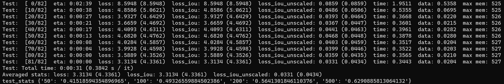

# DenoisingTAD (under preparation)

## Dependencies

- Python 3.7 or higher
- [PyTorch](https://pytorch.org/) **1.6** or higher
- [Torchvision](https://github.com/pytorch/vision)
- [Numpy](https://numpy.org/) 1.19.2

## Data Preparation

To reproduce the results in THUMOS14 without further changes:

1. Download the data from [GoogleDrive](https://drive.google.com/drive/folders/13KwgSgeZKWwIYE77PVo4_dvZhf8qQisJ?usp=sharing).

2. Place I3D_features and TEM_scores into the folder `data`.

## Checkpoint

Dataset  | AR@50 | AR@100 | AR@200 | AR@500 | checkpoint
:--: | :--: | :--: | :--:|  :--:| :--:
THUMOS14 | 41.52 | 49.33 | 56.41 | 62.91 | [link](https://drive.google.com/file/d/1h20GnPhaJP3QkwVspn_ndXevJ97FGpE6/view?usp=sharing)



## Training

Use `train.sh` to train RTD-Net.

```

# First stage

CUDA_VISIBLE_DEVICES=0,1 python -m torch.distributed.launch --nproc_per_node=2 --master_port=11323 --use_env main.py --window_size 100 --batch_size 32 --stage 1 --num_queries 32 --point_prob_normalize

# Second stage for relaxation mechanism

CUDA_VISIBLE_DEVICES=0,1 python -m torch.distributed.launch --nproc_per_node=2 --master_port=11324 --use_env main.py --window_size 100 --batch_size 32 --lr 1e-5 --stage 2 --epochs 10 --lr_drop 5 --num_queries 32 --point_prob_normalize --load outputs/checkpoint_best_sum_ar.pth

# Third stage for completeness head

CUDA_VISIBLE_DEVICES=0,1 python -m torch.distributed.launch --nproc_per_node=2 --master_port=11325 --use_env main.py --window_size 100 --batch_size 32 --lr 1e-4 --stage 3 --epochs 20 --num_queries 32 --point_prob_normalize --load outputs/checkpoint_best_sum_ar.pth
```

## Testing

Inference with `test.sh`.

```
CUDA_VISIBLE_DEVICES=0,1 python -m torch.distributed.launch --nproc_per_node=2 --master_port=11325 --use_env main.py --window_size 100 --batch_size 32 --lr 1e-4 --stage 3 --epochs 20 --num_queries 32 --point_prob_normalize --eval --resume outputs/checkpoint_best_sum_ar.pth
```
